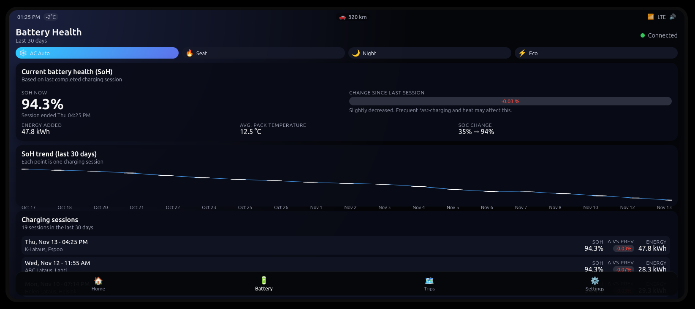

# EV Infotainment UI (Demo Project)

This project is a mock EV infotainment system built with React + TypeScript + Vite, designed to simulate how an in-car display could show battery State of Health (SoH) and charging session history.



It includes:

- A charger simulator API (mock backend)
- A beautiful infotainment-style UI
- A fixed 21:9 car-like viewport
- A bottom navigation bar fixed within the screen
- Smooth scrolling and EV-inspired design elements

This UI is intended for demo purposes as part of a larger system where: Charger → Backend → Infotainment UI (charger sends charging data → backend calculates SoH → UI visualizes last 30 days).

## Features

### Battery Health Visualization

- Live SoH reading for the latest charging session
- Change vs previous session
- Temperature, SoC, and energy added summary

### Trend Chart

- 30-day SoH trend displayed with a custom SVG line chart
- Session points rendered with minimal dependencies

### Charging History

- Scrollable list of all charging sessions
- Shows SoH, Δ vs previous, and energy added for each session

### Infotainment-Style UI

- Status bar with icons (time, temperature, connectivity)
- Quick control strip (AC, night mode, eco mode – static)
- Bottom navigation menu (Home / Battery / Trips / Settings)
- Fixed 21:9 viewport with realistic bezel and rounded corners

### Mock Backend

- Generates realistic charging history for the last 30 days
- SoH degrades slowly over time
- Used when VITE_USE_MOCK_API=true

## Tech Stack

- React (with TypeScript)
- Vite
- CSS only

## Getting Started

1. Install dependencies

```bash
npm install
```

2. Run in mock mode

Create a .env file:

```ini
VITE_USE_MOCK_API=true
```

Then start the dev server:

```bash
npm run dev
```

The infotainment UI will open at `http://localhost:5173/`.

3. Using a real backend (optional)

Set:

```ini
VITE_USE_MOCK_API=false
VITE_API_BASE_URL=https://your-backend.example.com
```

The UI will fetch real session data from the backend.
